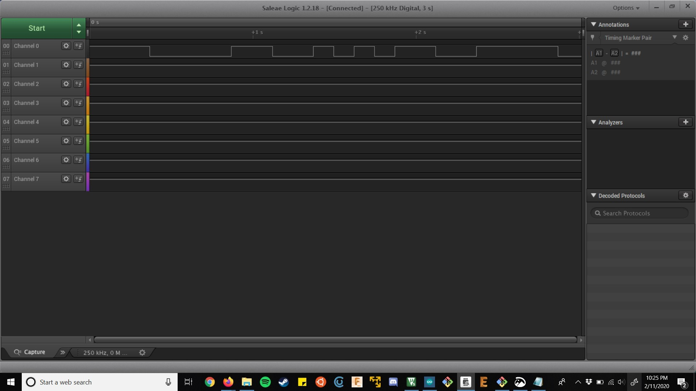
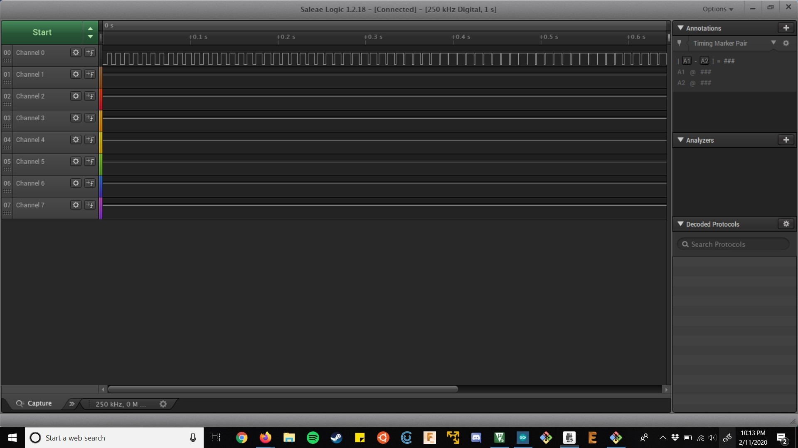
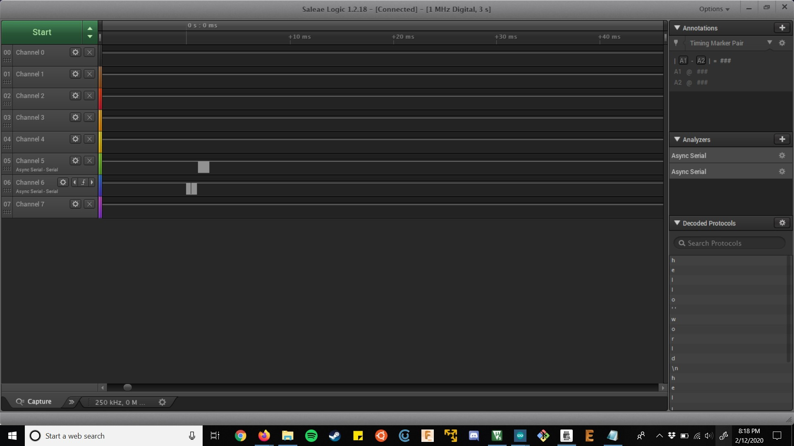
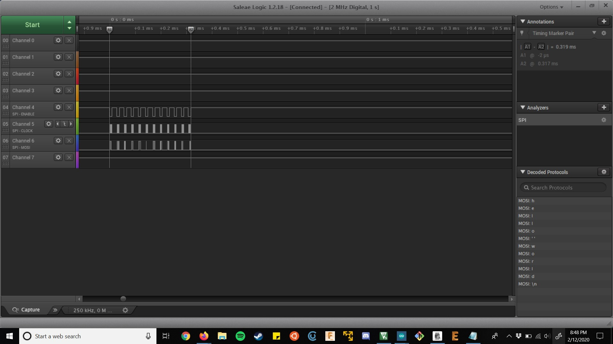

Name: Alejandro Neff

EID: ain274

Team Number: ??

## Questions

1. Why does your program need a setup and a loop?

Setup is for initialization, loop is to be run continuously to make your code operate

2. What is the downside to putting all your code in a loop?

It isn't modular to put all the code in a single loop 

3. Why does your code need to be compiled?

The compiler turns the code we write into something the microcontroller can read

4. When lowering the frequency in procedure A, step 4, what is going wrong? Brainstorm some solutions. Dimmers exist in the real world. What is their solution?

The frequency, while it is much lower than 100, isn't quick enough to "trick" our eyes into thinking it's continuously on, so it blinks rather than dims.
A solution would be to hold the duty cycle at a lower value while maintaining a high frequency - manipulating only the duty cycle seemed to leave
the light dimmed without seeing a blink pattern.

5. Why do you need to connect the logic analyzer ground to the ESP32 ground?

Voltage is relative, so the voltage read by the analyzer must be relative to the circuit's ground.

6. What is the difference between synchronous and asynchronous communication?

Synchronous comms require a common clock signal
Asynchronous means they don't require a shared clock.

7. Profile of UART: Sent X bytes in Y time 

    11 bytes in 1 ms

8. Profile of SPI: Sent X bytes in Y time

    11 bytes in .319 ms

9. Why is SPI so much faster than UART?

  It is a synchronous protocol that has individual lines for each direction of communication.

10. list one pro and one con of UART

  UART requires less wires (pro) but it is slower than SPI (con)

11. list one pro and one con of SPI

  SPI is faster since it's synchronous (pro) but it requires more wires (con)

12. list one pro and one con of I2C

  I2C lines require only two pins & support multiple slaves (pro) but they're sensitive to interference (con)

13. Why does I2C need external resistors to work?

  The lines are open drain so they require pullup/pulldown resistors, but the built-in resistors are weak, requiring a slower clock speed.

## Screenshots

Procedure A, step 1:

Procedure A, step 4:

Procedure B, UART:

Procedure B, SPI:

